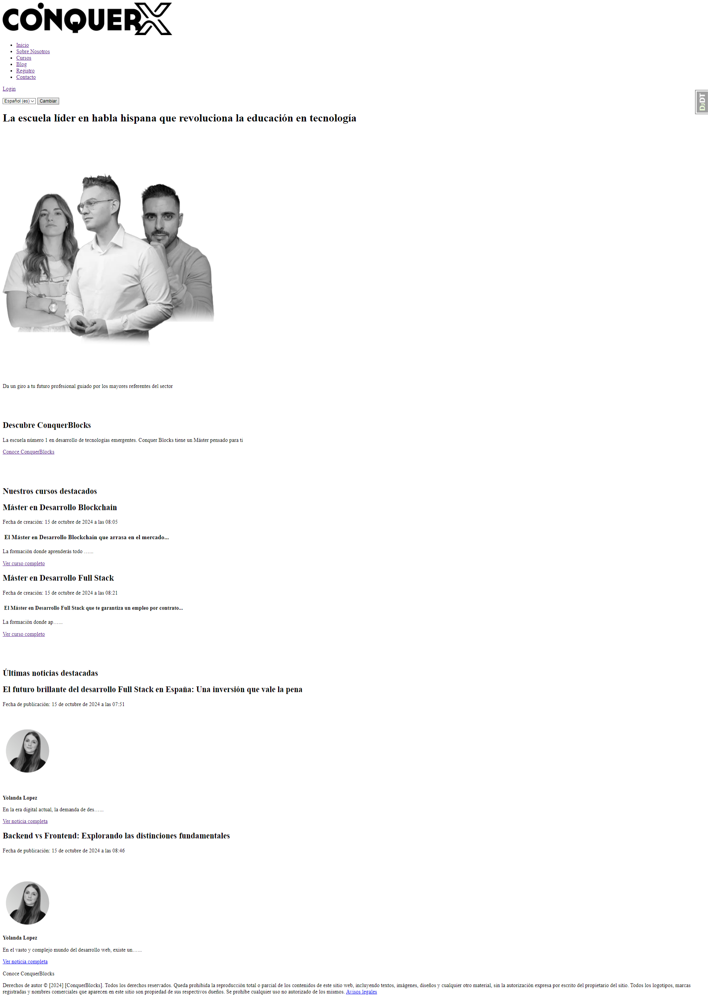
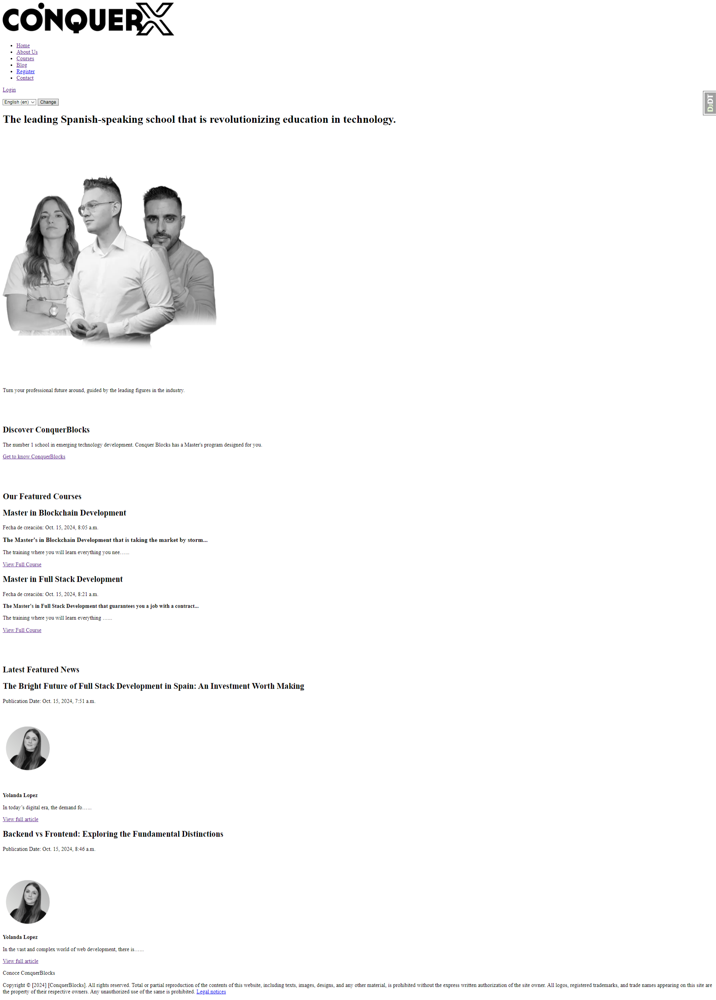
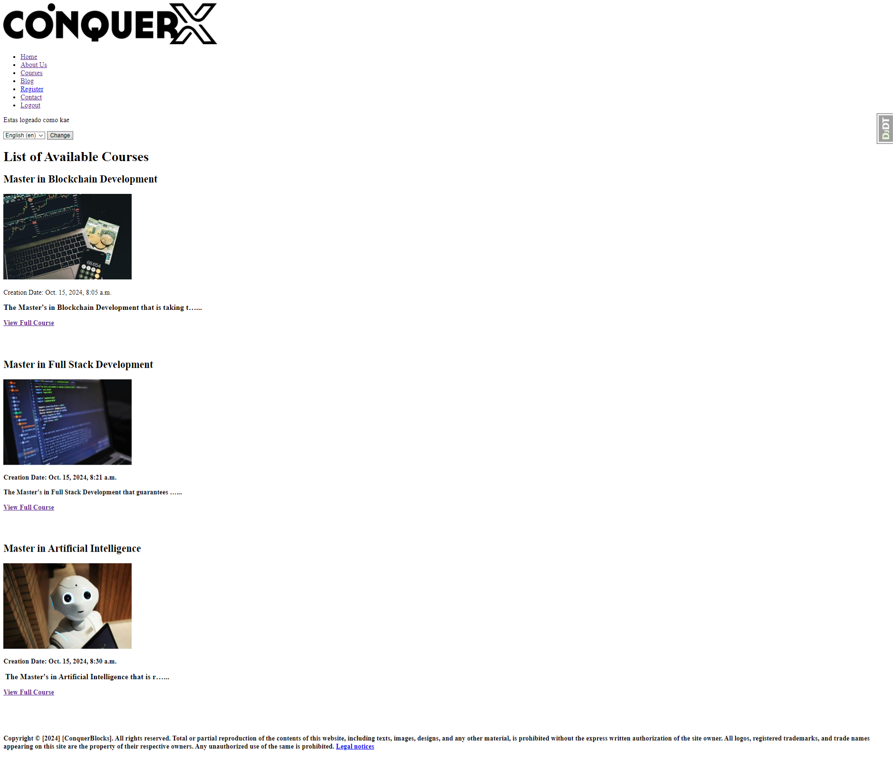
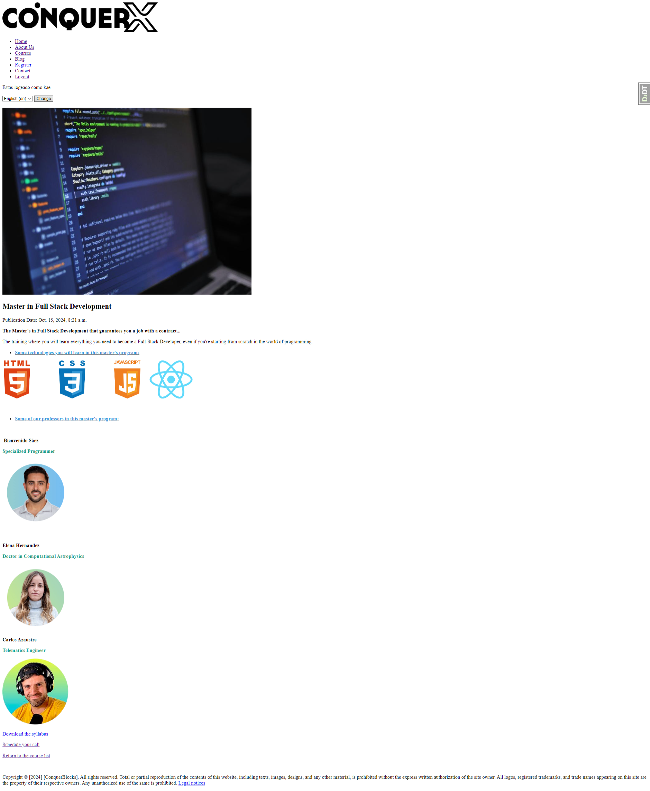
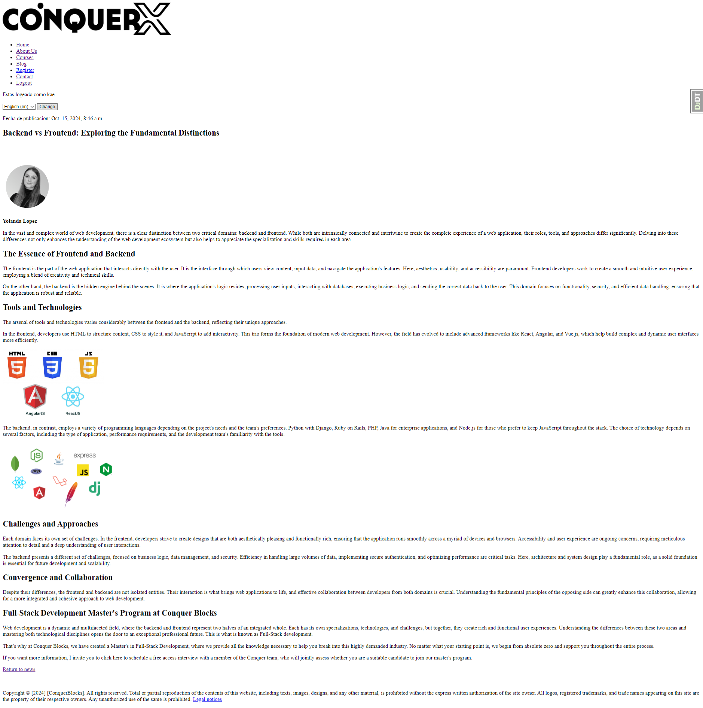

## ESP:

# Proyecto de Pagina Web de la academia Conquerblocks (Internacionalizado) 🧑‍🏫👩‍🏫

Esta es una página web sencilla sin estilos con varias vistas y funcionalidades como logearse, ver cursos si estas logieado (vistas protegidas), ver noticias destacas desde la Home Page.... Todo realizado con **HTML** y **Django**. La página web cuenta con una versión en español y otra en inglés. Podemos cambiar la versión con tan solo darle a un botón gracias a Django Rosetta. El proyecto también cuenta con vistas protegidas.

## 🎯 Objetivo del Proyecto

El objetivo de este proyecto es crear una página web con funcionalidades y desde el admin crear las diversas noticias y cursos que queramos. Primeros acercamientos al Backend

## 👁️ Vista previa del proyecto








## 🛠️ Estructura del Proyecto

El proyecto está organizado en varias carpetas y archivos para facilitar su mantenimiento y expansión:

Una carpeta **blog** que corresponderá a la app de las noticias:
- **admin.py**: Fichero donde registramos y personalizamos nuestros modelos para que aparezcan en el admin de Django.
- **models.py**: Fichero donde creamos nuestro modelo de post.
- **urls.py**: Fichero donde definimos y conectamos nuestras urls de post.
- **views.py**: Fichero donde creamos nuestras vistas de post.
- **translation.py**: Fichero donde traducimos nuestro modelo para que en el admin aparezca un campo en español y otro en ingles para que sea traducible.

Una carpeta **conquerblocks** que corresponderá a la app principal:
- Una carpeta **static** que contendrá las imagenes principales para el proyecto
- Una carpeta **templates** donde se crearan todas las plantillas HTMLs de nuestro proyecto
- **urls.py**: Fichero donde definimos nuestras URLs principales.
- **settings**: Fichero donde pondremos todas las configuraciones del proyecto, como INSTALLED_APPS, MIDDLEWARES...

Una carpeta **core** que corresponderá a una subapp con modelos core, que sería como los modelos y vistas principales del proyecto.
- **admin.py**: Fichero donde registramos y personalizamos nuestros modelos para que aparezcan en el admin de Django.
- **models.py**: Fichero donde creamos nuestro modelo de contact.
- **urls.py**: Fichero donde definimos y conectamos nuestras urls de home, login, register, logout, contact, about_us, avisoslegales.
- **views.py**: Fichero donde creamos nuestras vistas de home, login, register, logout, contact, about_us y avisoslegales.
- **forms.py**: Fichero donde creamos nuestros formularios de contacto, login y register

Una carpeta **courses** que corresponderá a la app de cursos:
- **admin.py**: Fichero donde registramos y personalizamos nuestros modelos para que aparezcan en el admin de Django.
- **models.py**: Fichero donde creamos nuestro modelo de cursos.
- **urls.py**: Fichero donde definimos y conectamos nuestras urls de cursos.
- **views.py**: Fichero donde creamos nuestras vistas de cursos.
- **translation.py**: Fichero donde traducimos nuestro modelo para que en el admin aparezca un campo en español y otro en ingles para que sea traducible.

Una carpeta **images** con capturas del proyecto para mostrar una vista previa del mismo en este README

Una carpeta **locale** que será la encargada de internacionalizar el proyecto gracias a las traducciones hechas con Django Rosetta

Una carpeta **media** que servirá para que desde el admin podamos seleccionar que archivos pdf queremos descargar en las vistas de cursos y también para poner portadas a cursos y blogs

Una carpeta **static** con varias herramientas de django instaladas como django debug toolbar, ckeditor para mejorar el textarea base de Django...

**manage.py**: Fichero que recoge las funcionalidades y manejo de django.

**requirements.txt**: Fichero que recoge los requerimientos que hacen falta para que el proyecto funcione adecuadamente. Se deberán instalar en un nuevo entorno virtual


## 🚀 Funcionalidades y uso

- **Registro**: La página cuenta con un formulario para registrar usuarios que quedarán guardados en la base de datos. Es muy importante registrarse para
  poder utilizar al 100% la página, ya que se requiere un usuario para ver la vista Cursos.
  
- **Iniciar sesión**: Podrás logearte con tu usuario registrado previamente.

- **Posibilidad de contacto**: El proyecto cuenta con un formulario de contacto el cual está conectado a mi correo, por lo cual se puede contactar conmigo también de esta manera

- **Internacionalización**: El proyecto cuenta con traducción al inglés. Solo debemos utilizar el desplegable para llevar a cabo el cambio. Están traducidas
  todas las vistas del proyecto y todos los modelos, así como su información.

- **Vistas protegidas**: Los usuarios que no estén logeados no podrán consultar los cursos.

- **Uso del admin**: Si te registras, puedes utilizar el admin de django con ese usuario poniendo /admin en el enlace y crear nuevos cursos y noticias con CKEDITOR

- **Errores en formularios**: Los formularios cuentan con mensajes de apoyo para cuando el usuario introduce mal algún dato. También existen campos 
  obligatorios que deberán rellenarse si o si


## 🛠️ Instalación y Ejecución

1. Clona este repositorio:
   ```bash
   https://github.com/kaeedev/Projects-Django.git

2. Crea un entorno virtual en el proyecto para instalar las dependencias necesarias:
   ```bash
   python3 -m venv venv
   
   ```
   o
   ```bash
   python -m venv venv
   ```

3. Inicia el entorno virtual que has creado:
   ```bash
   source venv/bin/activate

4. Instala las dependencias necesarias:
   ```bash
   pip install -r requirements.txt
   ```

5. Ejecuta el programa:
   Deberás runear un servidor local
   ```bash
   python manage.py runserver
   ```

6. Usar el admin de django si lo deseas:
   ```bash
   Añadir /admin al final del enlace del servidor local

## 📝 Licencia

Este proyecto está disponible únicamente para uso **docente** y con fines de aprendizaje.

### Condiciones:
- El código fuente de este proyecto puede ser usado, modificado y distribuido solo con fines educativos.

Si tienes alguna duda o quieres utilizar algún recurso de este proyecto, por favor contacta conmigo.

---
## ENG:

# Conquerblocks Academy Website Project (Internationalized) 🧑‍🏫👩‍🏫

This is a simple, unstyled website with various views and functionalities such as logging in, viewing courses if logged in (protected views), and checking featured news from the Home Page... All built with HTML and Django. The website has both Spanish and English versions, which can be switched easily with a button thanks to Django Rosetta. The project also includes protected views.

## 🎯 Project Objective

The goal of this project is to create a website with functionalities and the ability to create various news articles and courses from the admin. It serves as an initial approach to the Backend.

## 👁️ Project Preview
    

## 🛠️ Project Structure

The project is organized into several folders and files for easier maintenance and expansion:

A blog folder for the news app:

- admin.py: File where we register and customize our models to appear in the Django admin.
- models.py: File where we create our post model.
- urls.py: File where we define and connect our post URLs.
- views.py: File where we create our post views.
- translation.py: File where we translate our model so that in the admin, there’s a field in Spanish and another in English for translation.
- 
A conquerblocks folder for the main app:

- A static folder that contains the main images for the project.
- A templates folder where all the HTML templates for our project are created.
- urls.py: File where we define our main URLs.
- settings: File where we put all the project configurations, such as INSTALLED_APPS, MIDDLEWARES...
  
A core folder for a subapp with core models, which are the main models and views of the project.

- admin.py: File where we register and customize our models to appear in the Django admin.
- models.py: File where we create our contact model.
- urls.py: File where we define and connect our home, login, register, logout, contact, about_us, and legal notice URLs.
- views.py: File where we create our home, login, register, logout, contact, about_us, and legal notice views.
- forms.py: File where we create our contact, login, and register forms.
  
A courses folder for the courses app:

- admin.py: File where we register and customize our models to appear in the Django admin.
- models.py: File where we create our course model.
- urls.py: File where we define and connect our course URLs.
- views.py: File where we create our course views.
- translation.py: File where we translate our model for the admin with fields in both Spanish and English for translation.
  
A images folder with project screenshots to show a preview in this README.

A locale folder responsible for internationalizing the project through translations done with Django Rosetta.

A media folder to select PDF files for download in course views and to upload covers for courses and blogs.

A static folder with several installed Django tools such as Django Debug Toolbar and CKEditor to enhance the basic Django textarea.

manage.py: A file that encompasses Django functionalities and management.

requirements.txt: A file listing the requirements needed for the project to function properly. These must be installed in a new virtual environment.

## 🚀 Features and Usage

- Registration: The page has a user registration form that will be saved in the database. It's essential to register to fully utilize the site since a user is required to view the Courses page.

- Login: You can log in with your previously registered user.

- Contact Option: The project includes a contact form connected to my email, allowing you to contact me this way as well.

- Internationalization: The project features English translation. You can switch using the dropdown. All views and models, along with their information, are translated.

- Protected Views: Users who are not logged in will not be able to access the courses.

- Admin Usage: If you register, you can use the Django admin with that user by appending /admin to the local server link to create new courses and news with CKEditor.

- Form Errors: The forms include supportive messages for when users input incorrect data. There are also required fields that must be filled.

## 🛠️ Installation and Execution

- Clone this repository:
  ```bash
  https://github.com/kaeedev/Projects-Django.git
  
- Create a virtual environment in the project to install the necessary dependencies:
  ```bash
  python3 -m venv venv
  ```
  or  
  ```bash
  python -m venv venv
  
- Activate the virtual environment:
  ```bash
  source venv/bin/activate
  
- Install the necessary dependencies:
  ```bash
  pip install -r requirements.txt
  
- Run the program: You need to start a local server:
  ```bash
  python manage.py runserver
  
- Use the Django admin if you wish:
  ```bash
  Add /admin at the end of your local server link.
  
## 📝 License

This project is available solely for educational use and for learning purposes.

### Conditions:

The source code of this project can be used, modified, and distributed only for educational purposes.
If you have any questions or wish to use any resources from this project, please contact me.
